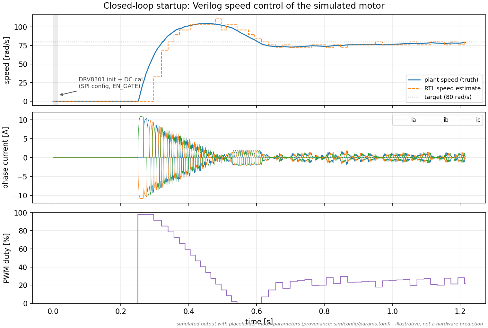
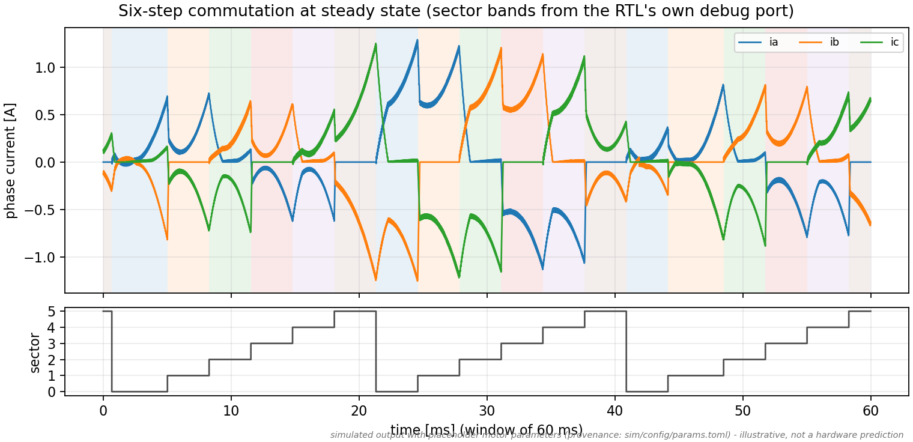
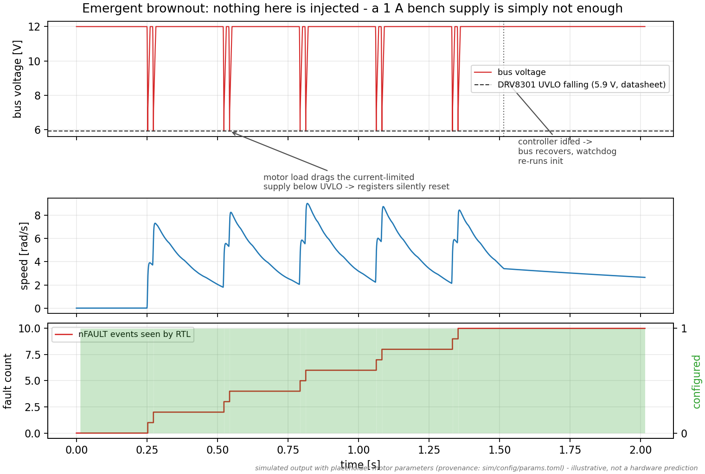
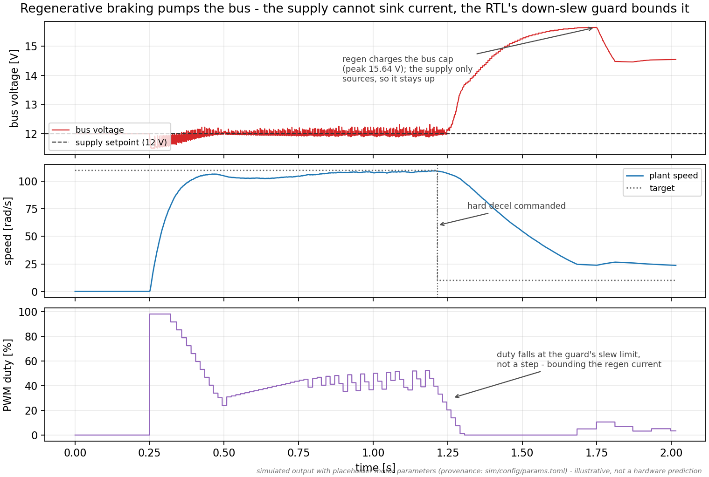
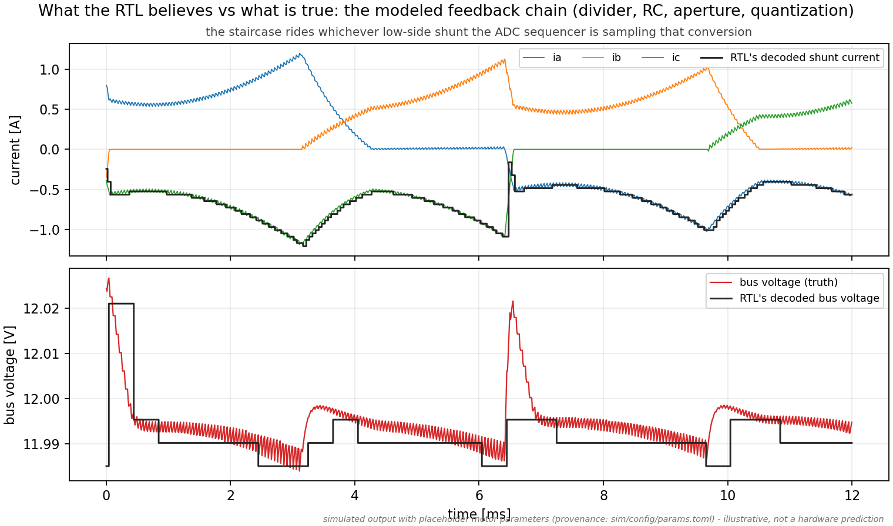
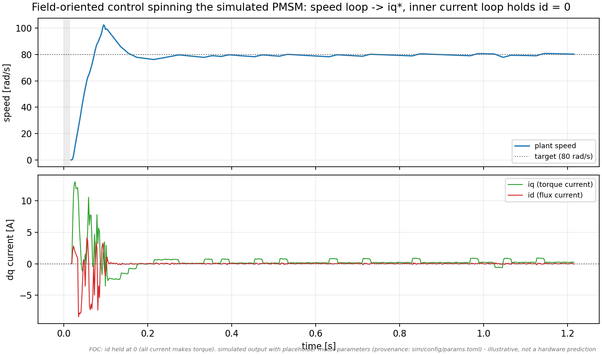

<!-- SPDX-License-Identifier: MIT -->
# motorloop

[](https://github.com/elliot-at-liminalnook/motorloop/actions/workflows/ci.yml)
[](https://github.com/elliot-at-liminalnook/motorloop/actions/workflows/formal.yml)
[](https://api.reuse.software/info/github.com/elliot-at-liminalnook/motorloop)
[](notes/release-checklist.md)
[](LICENSES/MIT.txt)

**Motor-in-the-loop verification for Verilog.** Run your controller RTL
closed-loop against a simulated motor, gate driver, and ADCs — before
hardware exists.

The RTL runs against behavioral models of the actual chips around it —
DRV8301 gate driver, MCP3208 ADC, AS5600 angle sensor — and an ODE model of
the inverter, motor, and bench power supply, all compiled into a single
process that advances in lockstep. The controller spins a simulated motor
through its real feedback circuits; tests assert on physics (speed, current,
bus voltage, die temperature), not just on waveforms.


## What this is — and isn't

**Is:** reusable, parameterized BLDC field-oriented-control HDL IP that ships
with the full bundle — per-block contracts (`rtl/contracts/`), SymbiYosys proofs
(12 PROVEN), a 400-test cycle-accurate co-sim, a cocotb block suite,
AXI-Lite/AXI-Stream/Wishbone wrappers (protocol legality *proven*),
FuseSoC/Bender/IP-XACT packaging, an open ECP5 synth flow (FOC datapath
pipelined to ~64 MHz), and a RISC-V (LiteX) reference SoC that drives the
controller over AXI-Lite.

**Isn't (yet):** silicon-validated. Everything is sim + formal + FPGA synthesis;
the controller has not driven a physical motor, and the control gains are
placeholder pending motor identification. The OpenLane pass is a *synthesizable
+ clean* smoke, not a tapeout. See [`notes/adoption-roadmap.md`](notes/adoption-roadmap.md).

**Reproduce it:** `docker build -f Containerfile -t motorloop . && docker run --rm motorloop`
(or `make all` locally) — see [`notes/reproduce.md`](notes/reproduce.md).

## The problem

Open-source FPGA motor controllers are almost universally verified
open-loop: drive the RTL with canned stimulus, inspect the PWM in a waveform
viewer, then go to the bench. The bugs that survive this are exactly the
ones that only exist closed-loop — a wrong SPI mode against the gate driver,
an off-by-one in ADC framing that silently halves every reading, a
commutation policy that limit-cycles only when back-EMF feeds back into the
next sector decision. On hardware these are slow to localize and sometimes
destructive; shoot-through does not offer a second attempt.

Commercial workflows solve this with Simulink/HDL-coder co-simulation or HIL
rigs. There was no open equivalent for hand-written Verilog: a way to
develop RTL against a plant instead of against a waveform viewer. This repo
is one.

## Ethos

The deeper aim is to make hardware uncertainty visible: what is measured,
what is copied from a datasheet, what is a design decision, and what is
still only a useful guess. The architecture is built around keeping those
claims separate. See [Why This Exists](notes/ethos.md).

## What it caught

The point of the bench is the class of bug it finds before hardware does.
All of these were found by failing tests here; none would have been found by
stimulus-replay testbenches:

- SPI master launched MOSI on the wrong edge for the DRV8301's mode-1
  timing — every register write silently corrupted.
- ADC framing collected one bit cycle early — all current/voltage codes
  halved. Closed-loop, the speed PI compensated and *almost* hid it.
- The stall detector false-tripped on a fast rotor whose angle aliased the
  sensor's PWM frame rate.
- Regenerative braking during a fast decel pumped the bus voltage into the
  supply's no-sink region; the RTL needed a duty down-slew guard.
- A 1 A bench-supply current limit reproduced TI's slva552 brownout
  app-note failure (bus sag → UVLO → silent register reset) with no fault
  injected — and verified the watchdog recovery path.

## How it works

```
            one process, one clock authority
┌──────────────┐  SPI   ┌──────────────────────────┐
│ Verilated    │◄──────►│ DRV8301 model (regs,     │
│ controller   │        │ faults, UVLO, OC, OT)    │
│ RTL          │  SPI   ├──────────────────────────┤
│ (your        │◄──────►│ MCP3208 model (aperture, │
│  Verilog)    │        │ residual, INL)           │
│              │  PWM   ├──────────────────────────┤
│              │◄───────│ AS5600 model             │
│              │ gates  ├──────────────────────────┤
│              │───────►│ inverter + motor + supply│
│              │        │ ODE plant (RK4, diodes)  │
└──────────────┘        └──────────────────────────┘
```

- **Lockstep, not FMI.** Verilator compiles the RTL to C++; peripherals and
  plant are C++ libraries; a single scheduler ticks everything. No
  co-simulation middleware, no time-sync drift, deterministic runs.
- **Protocol fidelity at the boundaries.** The DRV8301 model implements the
  N+1 pipelined SPI response, register semantics, and fault behavior from
  the datasheet; the ADC model samples during the real aperture window with
  charge-sharing residual from the previous channel. Peripherals sit behind
  role interfaces (gate driver / current ADC / angle sensor) selected by a
  config name, so a BOM is a *platform profile*, not a rewrite — the plant,
  control law, and formal proofs are part-agnostic. Eight datasheet-backed
  platforms ship today (DRV8301/DRV8302/DRV8323RS/DRV8316R, AS5600/AS5047P,
  MCP3208/ADS9224R), each retiring a specific open question in hardware: the
  AS5047P's DAEC angle (latency, Q22), the ADS9224R's dual-simultaneous sampling
  (Q21), the DRV8316R's integrated FET+CSA (clone-passive uncertainty, Q7).
  Protocol variants are runtime straps muxed into one bitstream. The same RTL
  also runs the open synthesis flow (yosys → nextpnr-ecp5 → ecppack, targeting a
  ULX3S/ECP5) under `synth/`.
- **Physics where it matters.** Switched bridge with body-diode conduction,
  event-to-event RK4 integration, and optional realism layers (all
  default-off, enabled per scenario): supply CV/CC/no-sink dynamics, cogging
  and stiction, ground-shift and gate-edge coupling into the feedback
  dividers, thermal RC lumps that feed resistance and Ke drift back into the
  plant, sensor eccentricity.
- **Driven from Python.** pybind11 bindings; tests are pytest. 372 tests
  cover protocol golden vectors, plant parity, closed-loop scenarios (six-step
  and FOC), bit-exact FOC-math parity, fault injection, and 29 edge cases
  (stall, flooded UART, dead driver, corrupted calibration, inertia
  extremes...). A shoot-through checker runs in every scenario.

## What a run looks like

Every figure below is generated by the bench itself —
`python3 sim/scripts/gen_readme_figures.py` re-runs the scenarios and
re-renders them from the shared trace schema. (Motor parameters are
placeholders, so these illustrate system behavior, not hardware
predictions.)



*The Verilog speed loop spinning the simulated motor: DRV8301 SPI init and
DC calibration, alignment, ramp, overshoot, settle. The dashed line is the
RTL's own speed estimate — the bench plots the controller's belief against
the plant's truth.*



*Steady-state commutation. The sector bands come from the RTL's debug
port; the current shapes (freewheeling decay through body diodes, back-EMF
curvature) come from the switched-bridge ODE plant.*



*The slva552 brownout, emergent: a 1 A current-limited bench supply sags
below the DRV8301's 5.9 V UVLO every time the motor tries to accelerate —
registers silently reset, nFAULT fires, the watchdog re-initializes, and
the cycle repeats until the controller is idled and the bus recovers.
There is no fault injection anywhere in this scenario.*



*Regenerative braking with a supply that cannot sink current: the bus
voltage rises during the decel, bounded because the RTL's duty down-slew
guard refuses to step the duty — it slews it.*



*The feedback chain in one frame: the plant's true currents and bus
voltage against what the RTL actually decodes after divider scaling, RC
lag, sample aperture, charge-sharing residual, and quantization. Control
loops live on the staircase, not the smooth line.*



*The same controller, field-oriented-control mode: the outer speed loop
commands the q-axis (torque) current while the inner current loop holds the
d-axis (flux) current at zero, so every amp makes torque. Bringing FOC up
against the plant is what surfaced the Q21 (current-sampling) and Q22
(angle-latency) findings — see the gallery.*

**More in the [figure gallery](figures/gallery.md):** locked-rotor
thermal drift, cogging-detent startup, the sensor-eccentricity signature,
per-cycle PWM ripple, the stall-detection raster, dead-time microscopy,
the three-way plant-parity residuals, and the FOC sampling/latency studies.

## Proven safety properties (formal)

The tests above *observe* safety invariants across simulation; an open-source
formal flow (Yosys + SymbiYosys, no proprietary tools) *proves* the
plant-independent ones for **all reachable states** — they hold regardless of
the unmeasured motor parameters. Unbounded-proven by k-induction:

- **Shoot-through freedom** — no leg ever drives both gates, at the
  `pwm_generator` boundary *and* at the integrated `controller_top` boundary
  (so the FOC/six-step muxing can't bypass it).
- **Dead-time minimum** — a gate asserts only after its complement has been
  off ≥ the dead-time, plus SVPWM duty bounds, PI saturation clamps, FSM
  legality, and reset safety.

The flow distinguishes unbounded **proofs** from bounded checks, records each
proof's **assumptions**, and guards against vacuous proofs with non-vacuity
covers — see the generated [`formal/proof_report.md`](formal/proof_report.md)
and [`notes/formal-checklist.md`](notes/formal-checklist.md). This is
verification, not validation: it closes the plant-independent half of
correctness completely; hardware correspondence still needs measurement.

## Every parameter states what it's worth

Simulation results are only as good as the numbers underneath them, so every
parameter in `sim/config/params.toml` carries a provenance status
(`measured` > `datasheet` > `decided` > `assumed` > `placeholder`). Every
run prints the unconfirmed ones and writes them as a sidecar next to each
output artifact:

```
==========================================================
  !! UNCONFIRMED ASSUMPTIONS: 75 parameter(s) !!
----------------------------------------------------------
  [placeholder] motor.R  = 0.5 Ohm   (Q1)
  [assumed    ] bus.vbus = 12.0 V    (Q5)
  ...
  Results below are NOT hardware predictions.
==========================================================
```

Parameters that come from circuit topology aren't hand-entered at all:
component values live in `[circuit.*]` tables and the derived values
(divider ratios, filter poles, ADC sampling residuals) are recomputed
mechanically — closed-form, by ngspice over the same netlists (including
TI's own amplifier macro model), and round-tripped through a generated KiCad
schematic. `derive_params.py --check` fails if any derived number drifts
from its spec.

## What this is not

- **Not validated against hardware.** The bench is internally consistent —
  three independent plant implementations (C++, Python, OpenModelica) agree
  to <0.5%, and SPICE agrees with the closed forms — but internal
  consistency is verification, not validation. Motor parameters are
  placeholders until measured. The repo includes a model-form harness
  (`compare_traces.py`, `fit_motor_params.py`, portable stimulus timelines)
  so that the day hardware traces exist, the comparison is a command, not a
  project.
- **Two control laws, one bench.** The reference RTL runs both sensored
  six-step (trapezoidal) *and* field-oriented control (sinusoidal PMSM:
  Clarke/Park, dq current PIs, SVPWM) — selectable per scenario, both
  verified closed-loop. Bringing FOC up against the plant surfaced real
  findings before any hardware: a single sequential MCP3208 can't sample two
  phase currents in time for the dq transform (the second lands ~22 µs late,
  after its shunt's conduction window closes — Q21), and the AS5600's angle
  latency costs torque that grows with speed unless the angle is
  extrapolated (Q22). See [`notes/foc-checklist.md`](notes/foc-checklist.md)
  and the FOC figures in the [gallery](figures/gallery.md). The bench itself
  is control-law-agnostic: any Verilog that talks SPI/PWM to these
  peripherals drops in.
- **Not analog simulation.** Feedback circuits are behavioral (validated
  against SPICE, but ODE/algebraic, not transistor-level). Sub-ns gate
  timing and EMI are out of scope.

## Quick start

```bash
git clone git@github.com:elliot-at-liminalnook/motorloop.git
cd motorloop
sim/scripts/check_cosim_toolchain.sh   # verilator, cmake, ninja, pybind11, pytest
sim/scripts/build_bench.sh
python3 -m pytest sim/tests            # full suite ~12 min; parity tiers in seconds

# watch it spin a motor
python3 sim/scripts/run_bench_scenario.py closed_loop --seconds 1.2
python3 sim/scripts/plot_trace.py sim/build/bench_closed_loop.csv
```

Optional tiers need `ngspice` (SPICE derivation checks), `kicad-cli`
(schematic round-trip), and OpenModelica `omc` (oracle parity). Tests for
missing tools skip rather than fail.

## Target hardware

The reference design models a specific bench so that every parameter has a
physical referent:

- FPGA: Sipeed Tang Primer 25K Dock (Gowin GW5A family)
- Power stage: ZONRI DRV8301-based 3-phase board (CRSS052N08N MOSFETs),
  a derivative of TI's DRV830x High Current EVM reference design
- ADC: Microchip MCP3208 (12-bit SPI); angle: ams OSRAM AS5600 (PWM out)
- Level shift: TXB0108 module (see `notes/hardware-bringup-notes.md` for
  why I2C through it is avoided)

## Vendor collateral

`docs/` holds datasheets, TI app notes, EVM design files, and TI's DRV8301
SPICE model — copyrighted material that is not redistributed here. Each
`docs/*/README.md` (committed) is an index of exactly what to download and
from where. Everything works without them; the one affected test
(`test_spice_derivations.py`'s DRV8301 macro cross-check) skips if
`DRV8301.LIB` is absent.

## Layout

- `rtl/` — the controller (six-step commutation, speed PI, fault manager,
  UART register file; 12 modules, lint-gated). `rtl/gen/rtl_params.vh` is
  generated from params.toml so RTL constants share the config's provenance.
- `sim/cpp/` — plant, peripheral models, lockstep scheduler, bindings
- `sim/config/params.toml` — single source of truth, provenance-flagged
- `sim/circuits/`, `hw/` — SPICE netlists and generated KiCad mirror of the
  feedback circuits
- `sim/modelica/` — independent plant oracle (run standalone via `omc`)
- `sim/scripts/` — build, derivation, scenario, plotting, and
  trace-comparison tools
- `sim/tests/` — the pytest suite (see `sim/README.md` for the tier map)
- `notes/` — architecture decision record, open questions (every
  assumption's Q-number resolves here), build checklists with findings,
  edge-case catalog, bring-up notes
