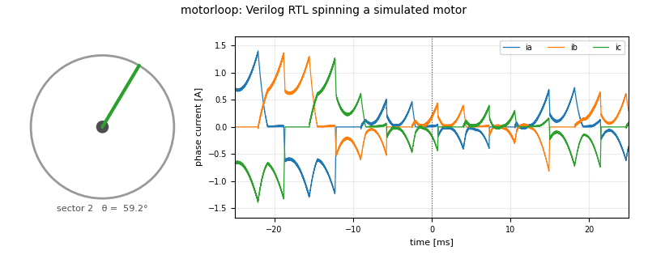

<!-- SPDX-License-Identifier: MIT -->
# motorloop

[](https://github.com/elliot-at-liminalnook/motorloop/actions/workflows/ci.yml)
[](https://github.com/elliot-at-liminalnook/motorloop/actions/workflows/formal.yml)
[](https://api.reuse.software/info/github.com/elliot-at-liminalnook/motorloop)
[](notes/release-checklist.md)
[](LICENSES/MIT.txt)

**End-to-end simulation environments for motor-control components and full robotic systems.**

Motorloop started as a Verilog motor-in-the-loop bench: controller RTL runs
closed-loop against modeled gate drivers, ADCs, sensors, an inverter, a motor,
and a bench supply. It has grown into a broader ecosystem for one question at
multiple scales:

> Does this design still work when the rest of the system pushes back?

That now includes component-level co-simulation, formal RTL safety proofs,
open synthesis, sensor/module studies, robot-body generation, MJX/GPU policy
training, combat-style contact tasks, and a verification stack that treats the
simulator itself as something to be audited — contract tests on compiled
physics, cross-engine checks against Drake, and red-team fixtures for every
reward. As of July 2026, the simulated quadruped **walks on command, on video**
(0.83 m/s), after an audit traced every historical training failure to a single
missing MJCF attribute that had silently capped the robot at 8% of its design
torque. The next fronts: adversarial self-play combat, and a real leg design
(worm-drive hip, series-elastic yaw, toggle-press blade foot) working its way
from CAD into the same pipeline.



## Current Shape

Motorloop is two connected worlds that share the same discipline: executable
claims, explicit assumptions, and tests that fail before hardware does.

| Scale | What is simulated | Main paths |
| --- | --- | --- |
| Motor-control components | Verilog controller, gate drivers, ADCs, angle sensors, inverter, motor, supply, faults | `rtl/`, `sim/cpp/`, `sim/tests/`, `formal/`, `synth/` |
| Sensor and platform choices | Datasheet-backed BOM variants, current-sense timing, motor choices, stress scenarios | `sim/config/`, `hw/`, `figures/`, `notes/*report.md` |
| Robot systems | Generated robot bodies, actuators, contact, opponents, commanded locomotion, fighter curricula | `sim/robot/`, `sim/rl/`, `notes/codesign-*.md` |
| Training orchestration | Remote GPU setup, tiny end-to-end validation, adaptive coaching, curriculum, league/self-play surface | `sim/robot/arena/`, `requirements-gpu.txt`, `notes/gpu-*.md` |

The useful split is:

```text
component scale                         robot scale
---------------                         -----------
RTL + real chip boundaries              robot.toml -> MJCF/MJX body
closed-loop plant tests                 policies under contact and uncertainty
formal safety proofs                    robust rankings and coached curricula
open synthesis                          arena pipeline toward self-play
```

## What Exists Now

**Component and RTL co-simulation.** The reference BLDC controller runs six-step
and FOC modes against behavioral models of DRV830x-class gate drivers, MCP3208
and ADS9224R-style current sampling, AS5600/AS5047P angle sensing, and an ODE
plant. Tests assert on physical state, decoded measurements, faults, bus
voltage, current, temperature, and controller belief, not just waveforms. See
[the architecture note](notes/architecture.md) and [simulation tier map](sim/README.md).

**Proofs where the plant is not needed.** The simulation tier observes safety
across scenarios; the formal tier proves plant-independent RTL properties such
as shoot-through freedom, dead-time minimum, legal bus wrappers, reset safety,
and bounds on control datapaths. See [formal/proof_report.md](formal/proof_report.md).

**Platform and component studies.** Gate-driver, current-ADC, and angle-sensor
alternatives; motor and part comparisons; stress studies. The point is not a
pretty plot — it's recording whether each claim came from a datasheet, a
measured trace, a decision, or a placeholder.

**Full robot simulation.** `sim/robot/robot.toml` is a provenance-tracked body
source that generates MJCF/MJX models. The robot stack covers morphology
co-design, commanded locomotion, combat/contact scoring, robust rankings under
world uncertainty, pneumatic striker experiments, and a fighter curriculum that
turned sparse contact from `dealt=0` into reliable engagement. See
[notes/codesign-fighter-report.md](notes/codesign-fighter-report.md).

**Arena orchestration.** `sim/robot/arena/` wraps the training kernel in a
traceable runner/scheduler framework: stages, curricula, league/self-play
surface, local and pod runners, build ledger, snapshots, and an adaptive coach
that moves reward weights based on held-out benchmark signals. See
[notes/framework-build-checklist.md](notes/framework-build-checklist.md).

**A verification stack the RL layer earned the hard way.** After metrics
claimed "walking" twice and a video falsified it both times, the robot side
adopted the RTL side's discipline: outcome-based contract tests on every
compiled model (`test_model_contract.py`), a preflight that refuses runs whose
configs cannot work, scripted exploit fixtures that must earn less than an
honest attempt before any reward change merges, pinned golden trajectories,
typed spec validation, and an independently-built Drake model that must agree
with MuJoCo on torque, mass, and statics before anything trains. The story and
the checks: [notes/training-uplift-audit.md](notes/training-uplift-audit.md),
[notes/rl-verification-playbook.md](notes/rl-verification-playbook.md).

## Status, Honestly

This is **verification and simulation**, not hardware validation.

- The RTL/component side is heavily tested, formally checked where appropriate,
  and synthesized through open flows, but it has not yet been correlated against
  a physical motor bench.
- The robot side crossed its first behavioral milestone in July 2026: a
  from-scratch policy that walks on command at 0.83 m/s, verified by rendered
  video (the project's hard rule: metrics select, videos confirm). Walk-then-
  fight curricula, a moving pursuer opponent, and PFSP league machinery are
  built and tested; open-ended self-play combat is the current frontier, not
  yet a result.
- A real leg mechanism is in CAD (`Test_Mesh_Leg_*`, `Robot_Assembly_*`): three
  motors per leg — series-elastic belt yaw, self-locking 20:1 worm pitch, and a
  powered toggle-press blade foot — with rigged kinematics, Drake statics, and
  MJCF-conversion metadata, pending bench measurements (pulley stiffness, yaw
  ROM) before it replaces the parametric capsule body.
- Real2Sim2Real hooks exist for actuator residuals, contact residuals,
  posterior world models, active identification, and robust scoring; the real
  hardware fit is intentionally gated on real measurements.

That distinction matters. A simulation is an executable claim, not truth. The
project's ethos is written up in [Why This Exists](notes/ethos.md).

## Reproduce

Local component/RTL path:

```bash
git clone git@github.com:elliot-at-liminalnook/motorloop.git
cd motorloop

sim/scripts/check_cosim_toolchain.sh
sim/scripts/build_bench.sh
python3 -m pytest sim/tests
make formal
```

Local robot-system checks:

```bash
make robot          # generate/prove/smoke the parametric robot scaffold
make arena-prove    # run every arena framework selftest
make codesign-rs    # sim-to-sim Real2Sim2Real checks
make commanded-prove
```

Remote GPU path:

```bash
pip install -r requirements-gpu.txt
make gpu-validate   # tiny sequential leak-test before any long run
make gpu-arena      # curriculum then league/self-play surface
```

See [notes/gpu-pod-setup.md](notes/gpu-pod-setup.md) for the exact RunPod
recipe and [notes/gpu-runbook.md](notes/gpu-runbook.md) for run order,
expected costs, and gotchas.

## Recent Notes

- [notes/sim-engine-secret-sauce-explained.pdf](notes/sim-engine-secret-sauce-explained.pdf) - rendered PDF companion for the simulator-engine survey
- [notes/sim-engine-secret-sauce-explained.html](notes/sim-engine-secret-sauce-explained.html) - rendered HTML companion for the simulator-engine survey
- [notes/sim-engine-secret-sauce.md](notes/sim-engine-secret-sauce.md) - MuJoCo/MJX/Warp/Newton/PhysX/Genesis engine survey
- [notes/sota-training-issues-explained.pdf](notes/sota-training-issues-explained.pdf) - rendered PDF companion for the SOTA training issues survey
- [notes/sota-training-issues-explained.html](notes/sota-training-issues-explained.html) - rendered HTML companion for the SOTA training issues survey
- [notes/sota-training-issues.md](notes/sota-training-issues.md) - cited survey of field-wide training issues, mapped to this stack
- [notes/uplift-execution-plan.md](notes/uplift-execution-plan.md) - executed training-uplift plan, status logs, and gate verdicts
- [notes/rl-verification-playbook.md](notes/rl-verification-playbook.md) - layered RL verification stack and why old checks missed failures
- [notes/system-tour.md](notes/system-tour.md) - walkthrough of the full motor-control and robot simulation system
- [notes/training-uplift-audit.md](notes/training-uplift-audit.md) - audit that found the 8%-torque bug and ranked training fixes

## Key Reports

- [notes/architecture.md](notes/architecture.md) - component co-simulation architecture
- [notes/ethos.md](notes/ethos.md) - why the project is organized around epistemic claims
- [formal/proof_report.md](formal/proof_report.md) - generated proof report
- [synth/portability_report.md](synth/portability_report.md) - portability and synthesis status
- [notes/part-comparison-report.md](notes/part-comparison-report.md) - BOM/platform comparison
- [notes/ads9224r-sim-validation-report.md](notes/ads9224r-sim-validation-report.md) - ADS9224R module study
- [notes/parametric-robot-scaffold.md](notes/parametric-robot-scaffold.md) - robot body generator
- [notes/codesign-realization-report.md](notes/codesign-realization-report.md) - co-design realization results
- [notes/codesign-fighter-report.md](notes/codesign-fighter-report.md) - fighter curriculum and combat ranking results
- [notes/framework-build-checklist.md](notes/framework-build-checklist.md) - arena framework build record
- [notes/training-uplift-audit.md](notes/training-uplift-audit.md) - the audit that found the 8%-torque bug + top-10 training fixes
- [notes/advanced-rl-implementation.md](notes/advanced-rl-implementation.md) - implementation record for RND, HER, PBT, and self-play upgrades
- [notes/rl-verification-playbook.md](notes/rl-verification-playbook.md) - why the old checks missed it; the layered check stack
- [notes/uplift-execution-plan.md](notes/uplift-execution-plan.md) - the executed plan, with status logs and gate verdicts
- [notes/system-tour.md](notes/system-tour.md) - the friendly walkthrough of the whole system
- [notes/sota-training-issues.md](notes/sota-training-issues.md) - cited survey of field-wide training issues, mapped to this stack
- [notes/sim-engine-secret-sauce.md](notes/sim-engine-secret-sauce.md) - simulator engine survey for MuJoCo/MJX/Warp/Newton/PhysX/Genesis ([HTML](notes/sim-engine-secret-sauce-explained.html), [PDF](notes/sim-engine-secret-sauce-explained.pdf))
- [notes/gpu-runbook.md](notes/gpu-runbook.md) - remote GPU runbook

## Layout

- `rtl/` - Verilog motor-control IP, wrappers, contracts, generated params
- `formal/` - SymbiYosys manifests, checkers, proof reports
- `sim/cpp/` - lockstep Verilator plant/peripheral bench
- `sim/tests/` - pytest suite and parity checks
- `sim/config/` - provenance-tagged simulation parameters
- `sim/circuits/`, `hw/` - circuit derivations, KiCad/SPICE mirrors, module work
- `sim/rl/` - MuJoCo robot policy experiments tied to the motor envelope
- `sim/robot/` - generated robot bodies, MJX envs, co-design, rankings, arena-facing kernels
- `sim/robot/arena/` - trace, stage, schedule, runner, coach, and pipeline orchestration
- `synth/` - open synthesis, portability, ASIC smoke reports
- `soc/` - LiteX/RISC-V reference SoC integration
- `notes/` - design records, reports, checklists, findings, and honest gaps
- `figures/` - committed media generated from the bench and studies

## Figure Index

<details>
<summary>Complete committed media index under <code>figures/</code></summary>

Gallery pages:
[core bench](figures/gallery.md),
[ADS9224R module](figures/ads9224r-module/gallery.md),
[part comparison](figures/comparison/gallery.md),
[motor comparison](figures/motors/gallery.md),
[stress tests](figures/stress/gallery.md).

Core bench:
[motorloop.gif](figures/motorloop.gif),
[startup](figures/startup.png),
[commutation](figures/commutation.png),
[brownout](figures/brownout.png),
[regen](figures/regen.png),
[adc_chain](figures/adc_chain.png),
[foc_startup](figures/foc_startup.png),
[thermal](figures/thermal.png),
[cogging](figures/cogging.png),
[eccentricity](figures/eccentricity.png),
[pwm_ripple](figures/pwm_ripple.png),
[stall_raster](figures/stall_raster.png),
[deadtime](figures/deadtime.png),
[parity](figures/parity.png),
[foc_sampling](figures/foc_sampling.png),
[foc_latency](figures/foc_latency.png).

ADS9224R module:
[signal_chain](figures/ads9224r-module/signal_chain.png),
[simultaneity](figures/ads9224r-module/simultaneity.png),
[scaling](figures/ads9224r-module/scaling.png),
[settling](figures/ads9224r-module/settling.png),
[loop_budget](figures/ads9224r-module/loop_budget.png),
[noise](figures/ads9224r-module/noise.png).

Part comparison:
[t1_latency](figures/comparison/t1_latency.png),
[t2_reversal](figures/comparison/t2_reversal.png),
[t3_skew](figures/comparison/t3_skew.png),
[t4_noise_floor](figures/comparison/t4_noise_floor.png),
[t5_snap](figures/comparison/t5_snap.png),
[t6_phase_margin](figures/comparison/t6_phase_margin.png),
[t7_resolution](figures/comparison/t7_resolution.png),
[t8_penalty](figures/comparison/t8_penalty.png),
[t9_dirty](figures/comparison/t9_dirty.png),
[t10_envelope](figures/comparison/t10_envelope.png).

Motor comparison:
[summary](figures/motors/summary.png),
[torque_speed](figures/motors/torque_speed.png),
[dynamics](figures/motors/dynamics.png),
[efficiency](figures/motors/efficiency.png),
[latency_coupling](figures/motors/latency_coupling.png).

Battlebot studies:
[retract_power](figures/battlebot/retract_power.png).

RL experiments:
[coupling_returns](figures/rl/coupling_returns.png),
[motor_envelope](figures/rl/motor_envelope.png),
[smoke_test](figures/rl/smoke_test.mp4),
[rand_baseline](figures/rl/rand_baseline.mp4),
[halfcheetah_db42](figures/rl/halfcheetah_db42.mp4),
[dodge_before](figures/rl/dodge_before.mp4),
[dodge_after](figures/rl/dodge_after.mp4),
[combat_before](figures/rl/combat_before.mp4),
[combat_after](figures/rl/combat_after.mp4),
[combat_hop](figures/rl/combat_hop.mp4).

Stress tests:
[A1_thermal](figures/stress/A1_thermal.png),
[A2_brownout](figures/stress/A2_brownout.png),
[A3_regen](figures/stress/A3_regen.png),
[A4_overcurrent](figures/stress/A4_overcurrent.png),
[A5_fault](figures/stress/A5_fault.png),
[B1_reversal_cliff](figures/stress/B1_reversal_cliff.png),
[B2_load_step](figures/stress/B2_load_step.png),
[C1_settle_limit](figures/stress/C1_settle_limit.png),
[C2_fullscale_clip](figures/stress/C2_fullscale_clip.png),
[D1_numeric_rails](figures/stress/D1_numeric_rails.png),
[D2_circle_sat](figures/stress/D2_circle_sat.png).

</details>
