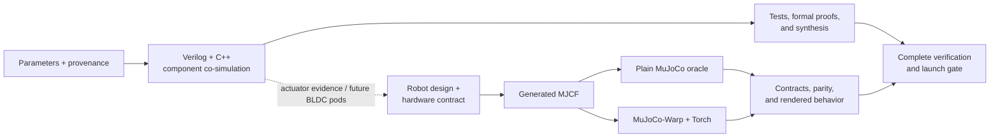

<!-- SPDX-License-Identifier: MIT -->
# motorloop

> **Document status:** Current · **Audience:** Newcomers · **Last reviewed:** 2026-07-12 · **Canonical for:** Repository overview and top-level navigation

[](https://github.com/elliot-at-liminalnook/motorloop/actions/workflows/ci.yml)
[](https://github.com/elliot-at-liminalnook/motorloop/actions/workflows/formal.yml)
[](https://api.reuse.software/info/github.com/elliot-at-liminalnook/motorloop)
[](https://github.com/elliot-at-liminalnook/motorloop/blob/main/notes/release-checklist.md)
[](https://github.com/elliot-at-liminalnook/motorloop/blob/main/LICENSES/MIT.txt)

**Verification and simulation from motor-control RTL to learned robot behavior.**

Motorloop asks one question at two scales: does a design still work when the
rest of its modeled system pushes back? One system runs Verilog motor-control
RTL against modeled electronics and motor physics. The other generates robot
bodies and trains policies with MuJoCo-Warp and Torch. They share contracts,
evidence rules, and one complete launch gate; the current servo robot does not
run the RTL controller inside every training step.


## The system in one view



The detailed boundaries and data flow are in
[`notes/system-architecture.md`](notes/system-architecture.md).

## Current truth

- The motor-control side is implemented, extensively simulation-tested,
  formally checked for selected plant-independent properties, and synthesized
  through open flows. It has **not** been correlated against a physical motor
  bench.
- The active robot path is plain MuJoCo plus MuJoCo-Warp and Torch. A dated
  combined CPU/CUDA launch-gate result exists, while long-run locomotion and
  combat promotion remain active work.
- A historical parametric-body policy demonstrated a rendered 0.83 m/s walk
  after a missing actuator ratio was fixed. The later 6 lb, twelve-servo physical
  design has its own locomotion gates; the older result is not hardware evidence
  for that design.
- Hardware identification, a closed physical mass and power budget, open-ended
  self-play combat, and complete sim-to-real validation remain unfinished.

For evidence, limitations, and precedence between reports, use the canonical
[`current project status`](notes/current-status.md).

## Choose your path

| Goal | Start here |
| --- | --- |
| Understand the project in 15 minutes | [`Getting started`](notes/getting-started.md) |
| See how the two systems connect | [`System architecture`](notes/system-architecture.md) |
| Walk the robot modeling → RL pipeline | [`Pipeline walkthrough`](notes/modeling-to-rl-pipeline.html) |
| Run the component/RTL bench | [`Simulation workspace`](sim/README.md) |
| Run or launch robot training | [`Robot/RL verification entry point`](notes/pre-gpu-test-entrypoint.md) |
| Inspect current claims and gaps | [`Current project status`](notes/current-status.md) |
| Reuse an RTL block | [`Reader path: reuse an RTL block`](notes/reader-paths.md#reuse-an-rtl-block) |
| Assess hardware readiness | [`Reader path: assess hardware readiness`](notes/reader-paths.md#assess-hardware-readiness) |
| Browse all maintained documentation | [`Documentation home`](notes/README.md) |

## Quick start

List the available targets:

```bash
make help
```

Run a focused component regression after installing the pinned dependencies:

```bash
make test
```

Run the fast local robot edit/check loop in the pinned Warp environment:

```bash
bash scripts/run_pre_gpu_tests.sh
```

That local command is not a complete verification result. Full repository setup
and gates are in [`notes/reproduce.md`](notes/reproduce.md); CUDA-host verification
and long-run authorization are in
[`notes/pre-gpu-test-entrypoint.md`](notes/pre-gpu-test-entrypoint.md).

## Repository map

| Path | Responsibility |
| --- | --- |
| `rtl/` | Motor-control RTL and reusable interfaces |
| `sim/cpp/`, `sim/tests/` | Lockstep plant/peripheral bench and component regressions |
| `formal/` | Plant-independent RTL properties and generated proof evidence |
| `synth/`, `soc/` | FPGA/ASIC flows, portability, and reference SoC integration |
| `sim/robot/` | Robot generation, MuJoCo/Warp physics, learning, and evaluation |
| `hw/`, `sim/circuits/` | Hardware, circuit derivations, and design artifacts |
| `notes/` | Curated guides, current summaries, references, and classified history |
| `figures/` | Generated plots, galleries, and behavior media |

## How claims work here

“Implemented,” “tested,” “formally proven,” “simulation-verified,”
“demonstrated,” and “hardware-validated” are different evidence levels. The
definitions live in [`notes/glossary.md`](notes/glossary.md). A simulation is an
executable claim under assumptions, not a measurement of reality.

Documentation ownership, lifecycle states, and freshness checks are defined in
[`notes/documentation-guide.md`](notes/documentation-guide.md). Historical plans
and retired procedures remain available through the
[`documentation archive`](notes/archive/README.md) without competing with current
instructions.

## License and citation

The project is MIT licensed; SPDX and REUSE metadata are checked in CI. Release
and citation metadata live in `CITATION.cff`, `.zenodo.json`, `CHANGELOG.md`, and
`VERSIONING.md`.
