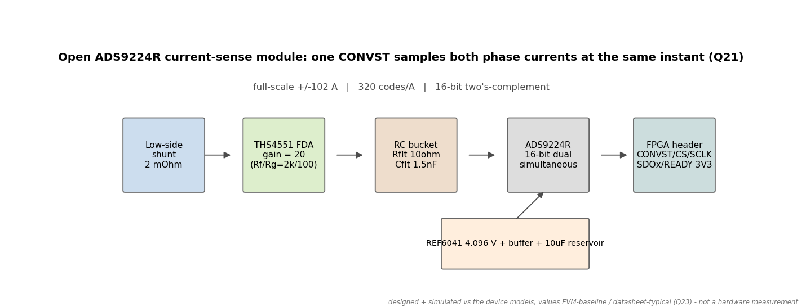
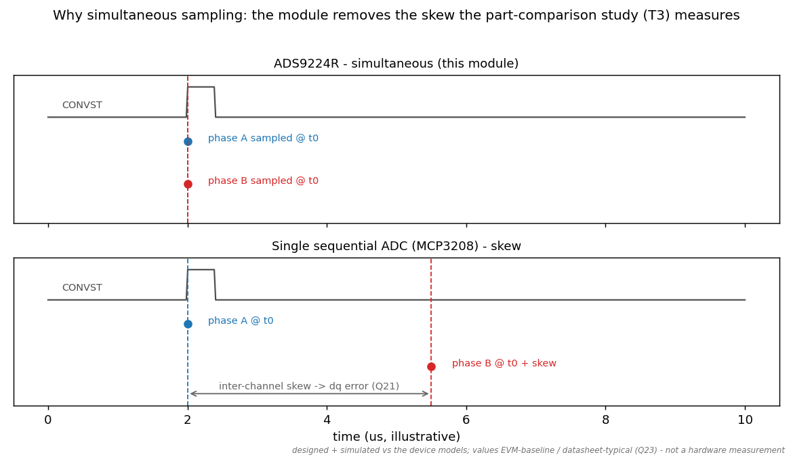
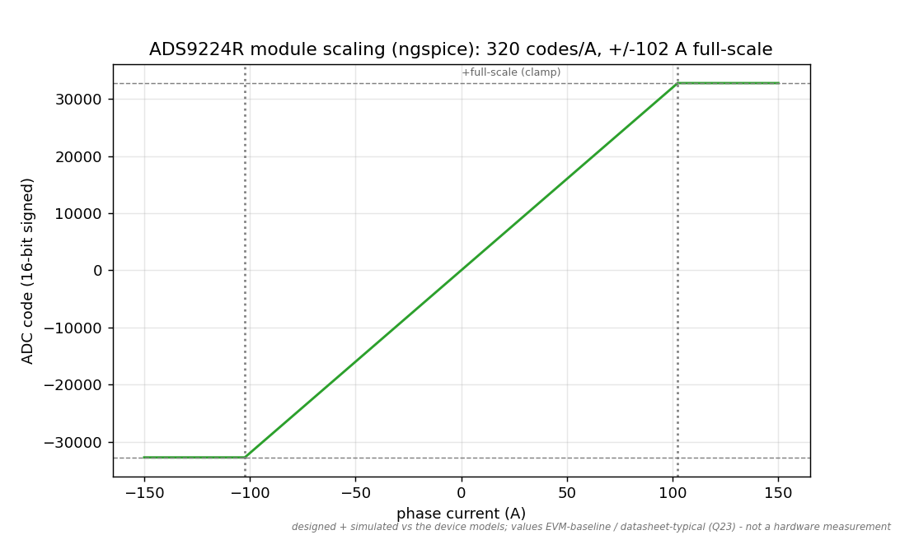
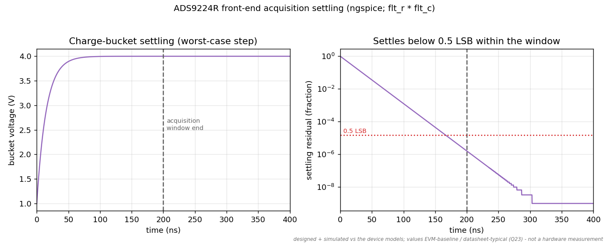

<!-- SPDX-License-Identifier: MIT -->
# Open ADS9224R module — figure gallery

Rendered by [`sim/scripts/gen_ads9224r_figures.py`](../../sim/scripts/gen_ads9224r_figures.py)
(`make ads9224r`). `scaling.png` and `settling.png` are live ngspice runs of the
front-end models (`sim/circuits/ads9224r_*.cir`) — the same models the derivation
tests assert on. **Standing caveat:** designed + simulated against the device
models; values EVM-baseline / datasheet-typical (Q23) — not hardware measurements.
Board docs: [`hw/ads9224r-module/`](../../hw/ads9224r-module/README.md).

### Signal chain

Low-side shunt → THS4551 FDA → RC charge-bucket → ADS9224R, buffered reference;
one CONVST samples both phases together.

### Simultaneity (why this part)

Simultaneous sampling vs the single-ADC skew the part-comparison study (T3) measures.

### Scaling (ngspice)

DC transfer: 320 codes/A, ±102 A full-scale at the default shunt/gain.

### Acquisition settling (ngspice)

The charge-bucket settles below 0.5 LSB within the acquisition window.
