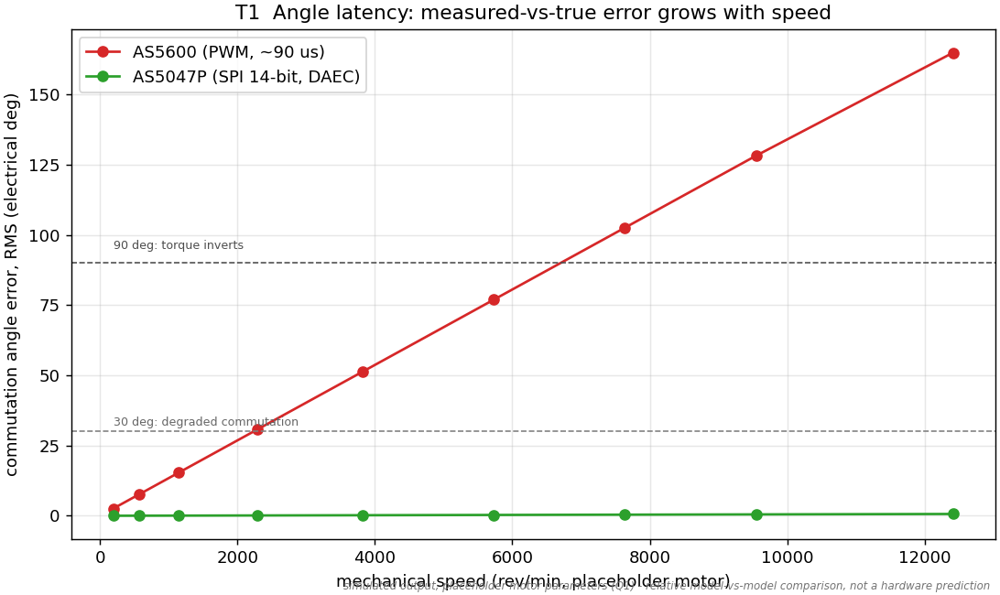
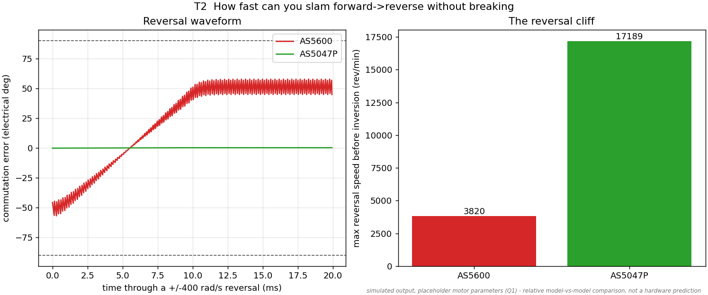
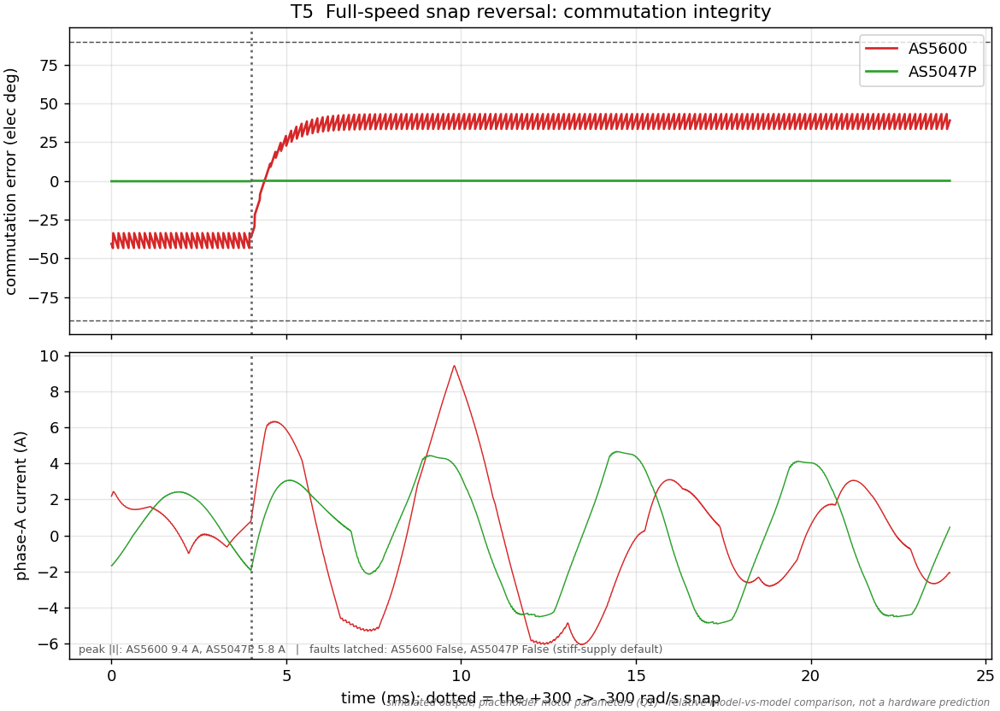
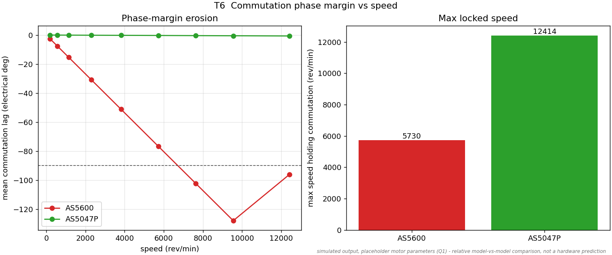
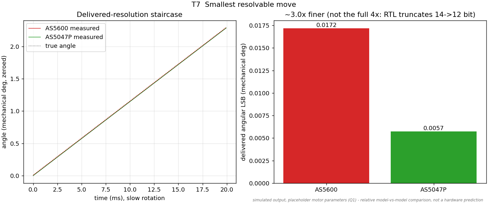
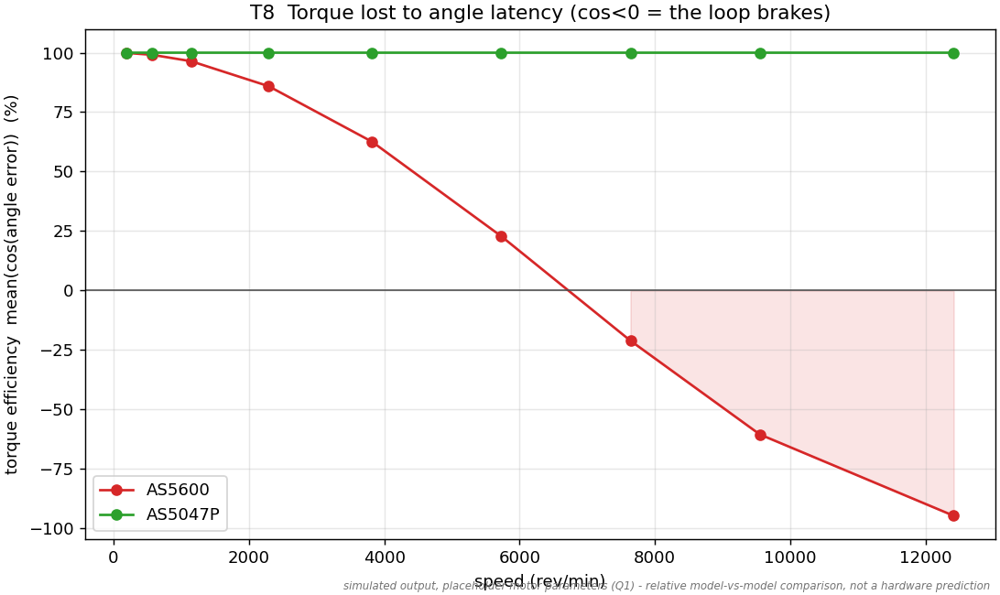
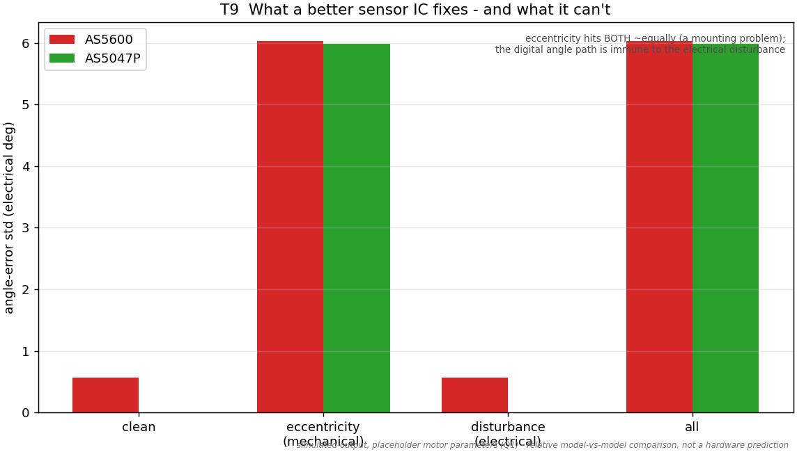
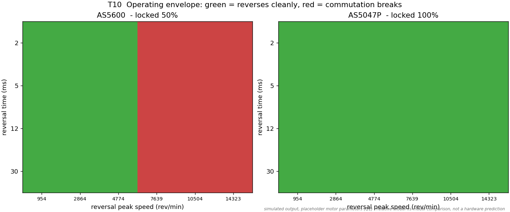
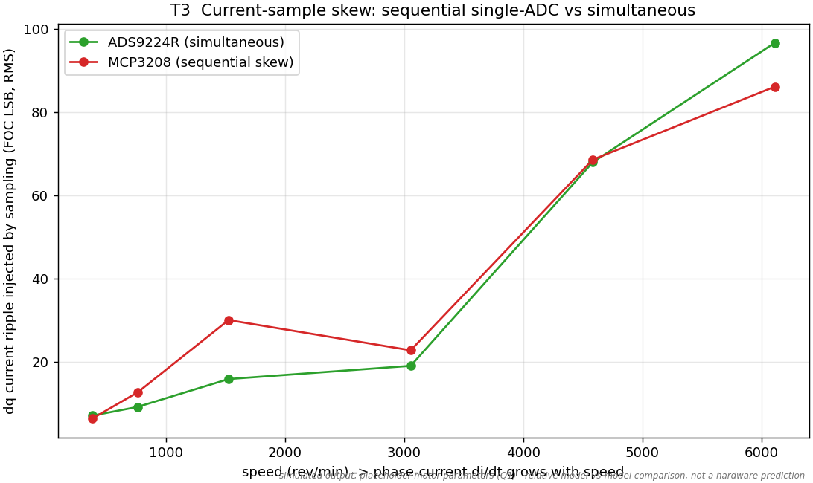
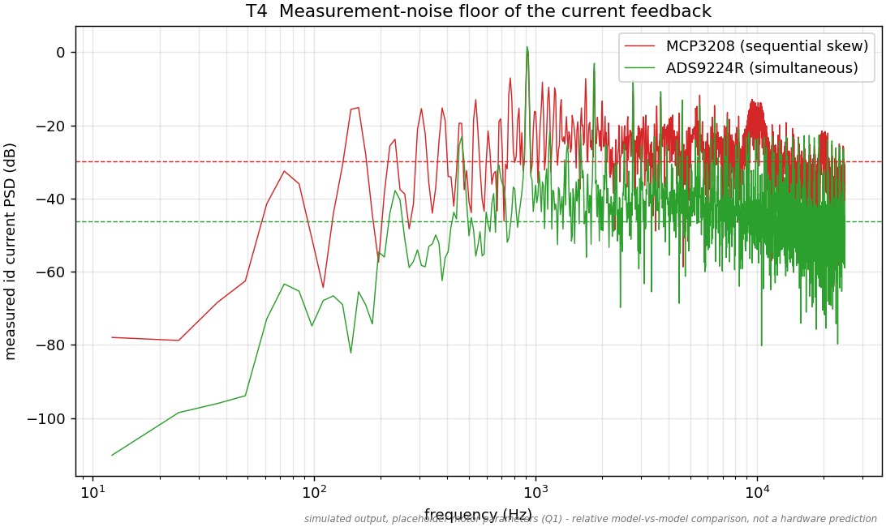

<!-- SPDX-License-Identifier: MIT -->
# Part-comparison gallery

Every image here is rendered from a live bench run by
[`sim/scripts/gen_comparison_figures.py`](../../sim/scripts/gen_comparison_figures.py)
(`make compare`) — the same experiments the pytest suite
[`sim/tests/test_part_comparison.py`](../../sim/tests/test_part_comparison.py)
asserts on. Each holds the FOC controller fixed and changes exactly one part.

**Standing caveat:** simulation against the device *models* (not silicon), with
placeholder motor parameters (Q1). These are **relative** model-vs-model
comparisons — orderings and ratios are meaningful, absolute thresholds are
illustrative. Full write-up: [`notes/part-comparison-report.md`](../../notes/part-comparison-report.md).

## Angle sensor — AS5600 vs AS5047P

### T1 · Angle latency vs speed

The measured-vs-true commutation error grows linearly with speed for the AS5600
(PWM, ~90 µs); the AS5047P (SPI, DAEC) stays flat — a ~260× gap.

### T2 · The reversal cliff

The max speed you can slam forward→reverse through before commutation inverts.

### T5 · Snap-reversal commutation integrity

A full-speed +Ω→−Ω flip: the AS5600's commutation error snaps ±40°+ while the
AS5047P holds; its phase currents are larger and phase-shifted.

### T6 · Commutation phase margin

The angle lag erodes with speed; the bars give each sensor's max locked speed.

### T7 · Smallest resolvable move

Slow-rotation staircase. The AS5047P delivers a finer step — but ~3×, not the
full 4× of 14-vs-12 bit, because the RTL/filter path truncates it.

### T8 · Torque lost to angle latency

mean(cos(angle error)): the AS5600's torque efficiency decays and goes *braking*
(cos<0) at high speed; the AS5047P stays ~100%.

### T9 · What a better IC fixes — and what it can't

Mechanical eccentricity hits **both** sensors ~equally (a mounting problem); the
digital angle path is immune to the electrical disturbance layer.

### T10 · Operating envelope

Speed × reversal abruptness. The AS5047P's locked region strictly contains the
AS5600's — and the boundary is set by reversal *speed*, not abruptness.

## Current sampling — MCP3208 vs ADS9224R

### T3 · Sample skew vs di/dt

The sequential single-ADC (MCP3208) injects more dq ripple than simultaneous
sampling (ADS9224R), growing with di/dt — Q21 made visible.

### T4 · Measurement-noise floor

The sequential path sits on a higher current-measurement noise floor.
