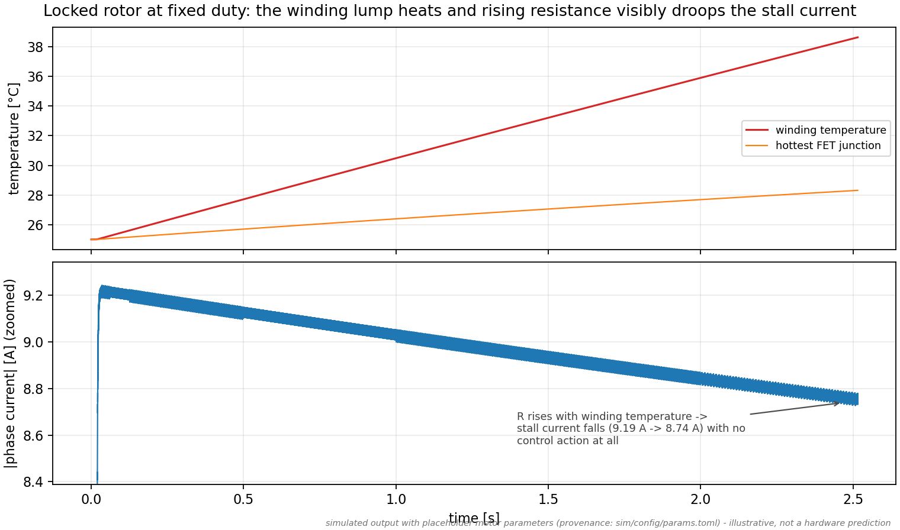
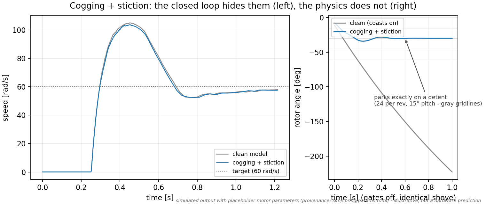
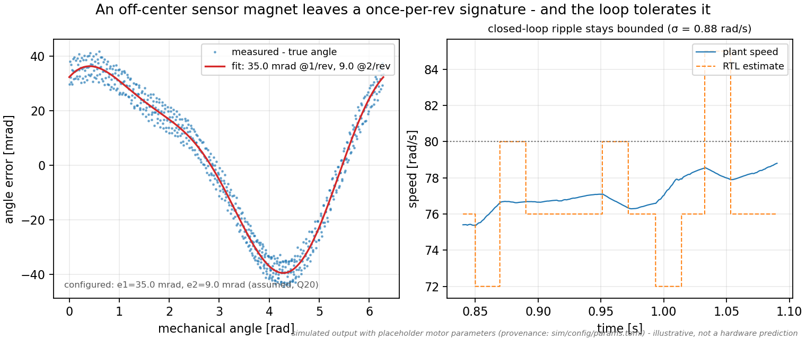
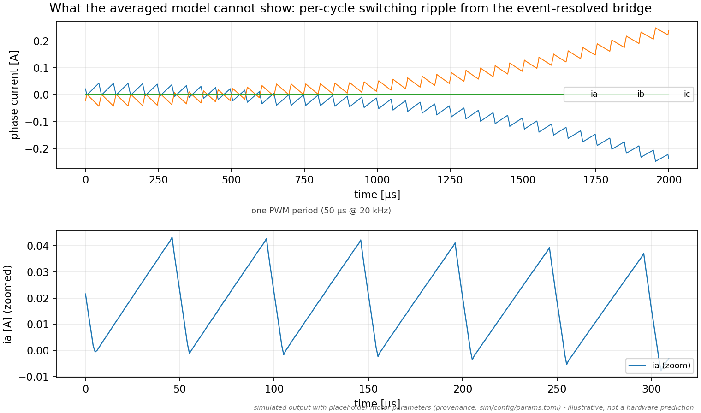
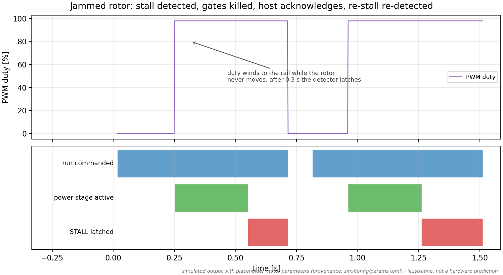
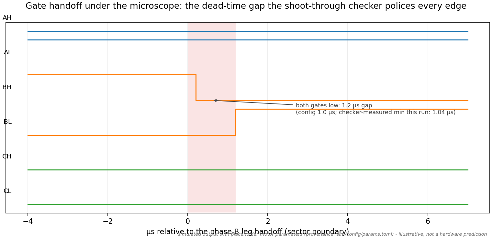
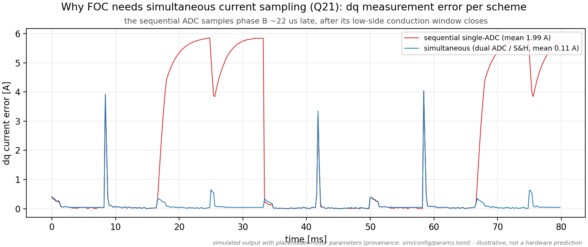
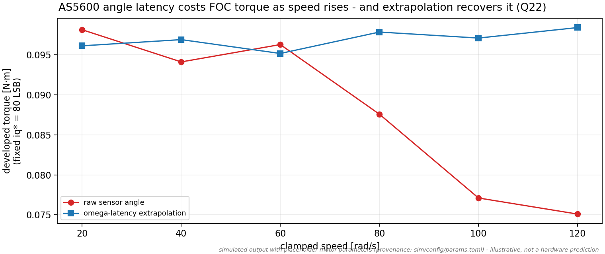
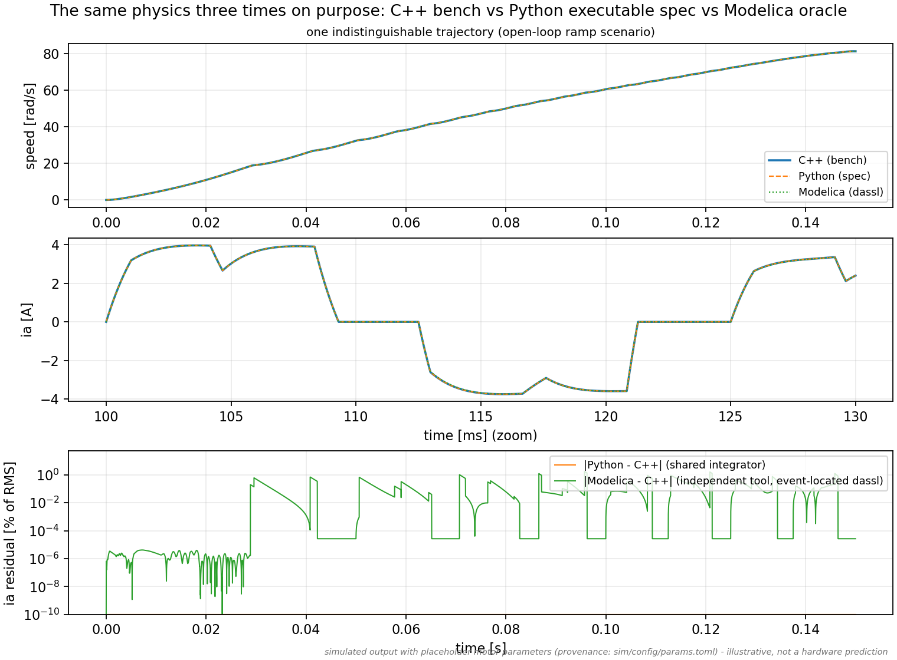

# Figure Gallery

Every image here is rendered from a live bench run by
[`sim/scripts/gen_readme_figures.py`](../sim/scripts/gen_readme_figures.py)
— no mockups, and each carries the standing caveat: motor parameters are
placeholders (provenance-flagged in `sim/config/params.toml`), so these
illustrate system behavior, not hardware predictions.

The headline figures (startup, commutation, brownout, regen, ADC chain,
and the animation) are embedded in the [top-level README](../README.md);
the three-way plant parity figure lives with the verification story in
[`sim/README.md`](../sim/README.md). The rest:

## Locked-rotor thermal drift



A locked rotor at fixed duty — the real stall hazard. The winding thermal
lump heats, its resistance rises, and the stall current visibly droops
with no control action anywhere. The drift feedback (R, Ke, Rds(on) as
functions of lump temperatures) is exactly what makes long-run behavior
differ from a cold-start simulation.

## Cogging and stiction



An honest negative result on the left: the closed-loop startup is nearly
identical with and without cogging + stiction, because the RTL's
alignment phase winds far more torque than the detent can resist. The
right panel shows the physics is real anyway — gates off, identical
shove, and the realism rotor parks *exactly* on one of the 24 detent
angles while the clean rotor coasts on (its only brake is viscous
damping). Models should differ where reality differs, and not where it
doesn't.

## Sensor eccentricity signature



An off-center AS5600 magnet produces a once-per-revolution (plus
2/rev) angle error. The left panel recovers the configured signature from
the running bench by least squares — the model validating its own
parameters — and the right panel shows the closed loop tolerating it.

## Per-cycle PWM ripple



A 2 ms window traced at 1 µs resolution: the switching ripple that an
averaged inverter model integrates away. The bench's event-resolved
bridge (with body-diode conduction) is what the three-way plant parity
checks actually exercise.

## Stall detection raster



A mechanically jammed rotor: duty winds to the rail, the angle-motion
discriminator sees no rotation, the stall detector latches safe-off and
kills the gates. The host acknowledges by idling — and with the jam still
present, re-running correctly re-detects it.

## Dead-time microscopy



A complementary gate handoff sampled every 200 ns: both gates of the leg
are low for the configured dead time before the opposite device turns on.
The always-on shoot-through checker measures this gap on every edge of
every scenario in the test suite.

## Field-oriented control (FOC)

The controller also runs as a sinusoidal-PMSM FOC drive (mode 3) — see
[`notes/foc-checklist.md`](../notes/foc-checklist.md). These are
bench-generated like everything else.


The outer speed loop commands the q-axis (torque) current; the inner current
loop holds the d-axis (flux) current at zero, so every amp makes torque. The
loop spins the simulated PMSM to the commanded speed.



Why FOC needs simultaneous current sampling: a single sequential MCP3208
samples phase B ~22 µs after phase A, by which point B's low-side shunt
conduction window has closed — the dq measurement error spikes to several
amps. A dual ADC / external sample-and-hold (freezing both at the PWM peak)
keeps it near zero. This is the bench measurement that resolves Q21.



The AS5600's frame + filter latency lags the true rotor angle, rotating the
dq frame off-true; the developed torque falls as speed rises. Advancing the
angle by ω·t_latency in the RTL recovers it. The curves coincide at low
speed (negligible lag) and diverge as speed climbs.

## Three-way plant parity



The same physics implemented three times on purpose — C++ bench plant,
dependency-free Python executable spec, OpenModelica oracle (dassl,
event-located switching). The residual panel is the point: the shared-
integrator pair agrees to ~1e-8, the independent tool to ~0.2% RMS.
Internal consistency is verification, not validation — but it is the
strongest verification available before hardware exists.

## Regenerating

```bash
python3 sim/scripts/gen_readme_figures.py            # everything
python3 sim/scripts/gen_readme_figures.py --only thermal,parity
```
