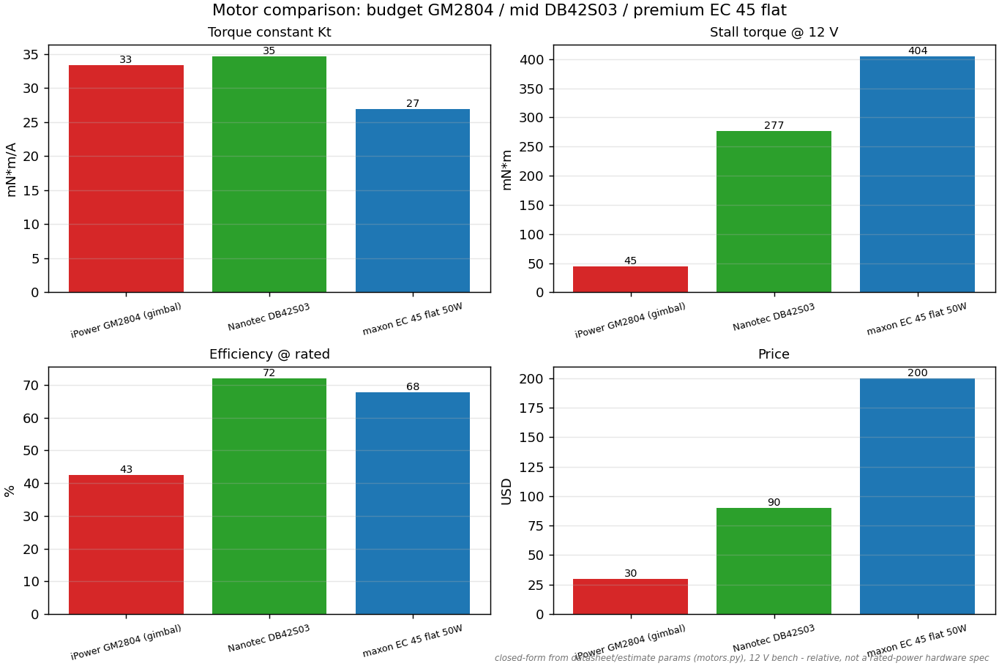
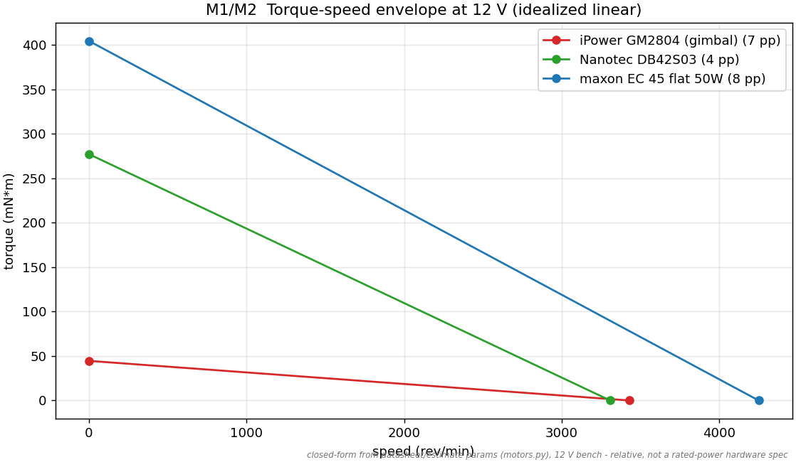
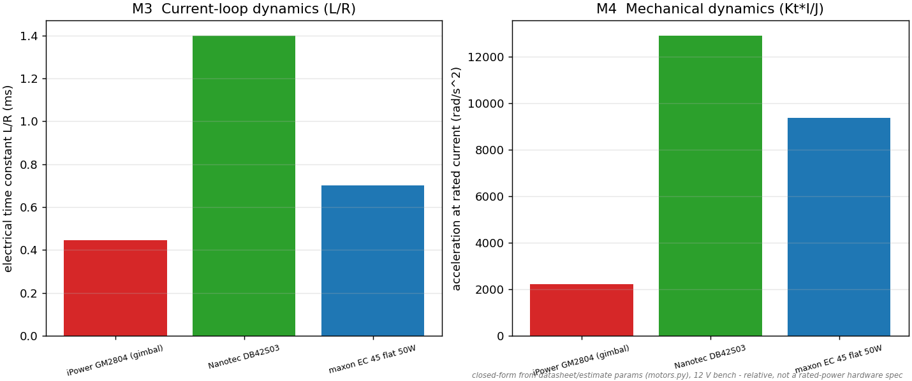
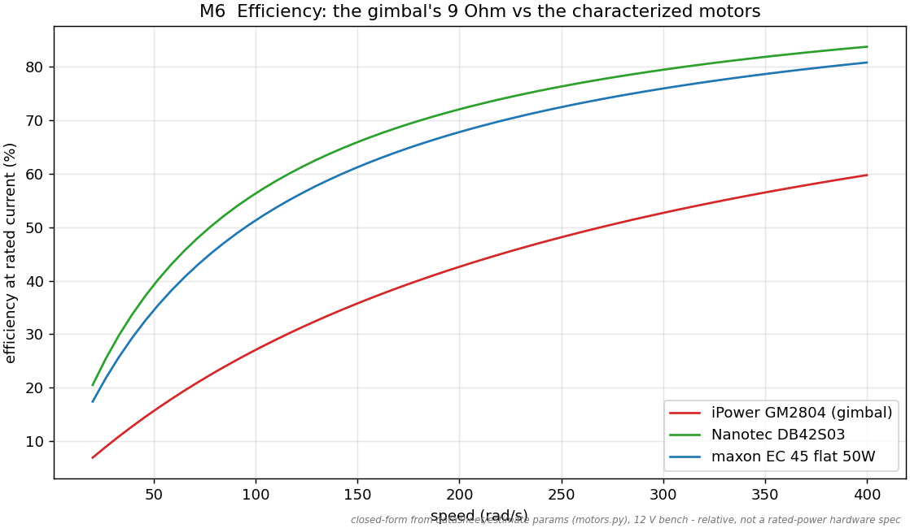
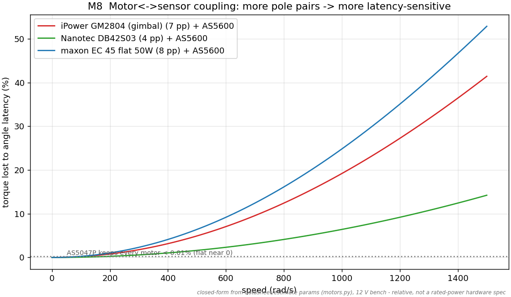

<!-- SPDX-License-Identifier: MIT -->
# Motor comparison gallery

Budget **iPower GM2804** vs mid **Nanotec DB42S03** vs premium **maxon EC 45
flat**, rendered by `sim/scripts/gen_motor_figures.py` (`make motors`),
asserted by `sim/tests/test_motor_comparison.py`. Write-up:
[`notes/motor-comparison-report.md`](../../notes/motor-comparison-report.md).
**Caveat:** model-based (datasheet/estimate params, `motors.py`), 12 V bench —
relative, not a rated-power hardware spec.

### Summary (Kt / stall torque / efficiency / price)

### M1/M2 Torque–speed envelope at 12 V

### M3/M4 Current-loop (L/R) + mechanical (Kt·I/J) dynamics

### M6 Efficiency at rated current

### M8 Motor↔sensor coupling — angle-latency torque loss vs speed

More pole pairs → more latency-sensitive: with the AS5600 the 8-pole maxon loses
~53 % torque at speed and the gimbal ~42 %, but the 4-pole DB42 only ~14 % — the
premium motors *need* the AS5047P. This is the same physics as the
part-comparison sensor study, now coupled to the motor choice.
