<!-- SPDX-License-Identifier: MIT -->
# Stress / extreme-scenario gallery

Pushing the system + code to the limit and showing the protections (and the
math) holding. Rendered by `sim/scripts/gen_stress_figures.py` (`make stress`);
asserted by `sim/tests/test_stress.py`. Write-up:
[`notes/stress-test-report.md`](../../notes/stress-test-report.md). **Caveat:**
placeholder motor gains (Q1) — illustrative edge behaviour, not hardware specs.

## A — System failure boundaries
### A1 Thermal runaway (locked-rotor cook)
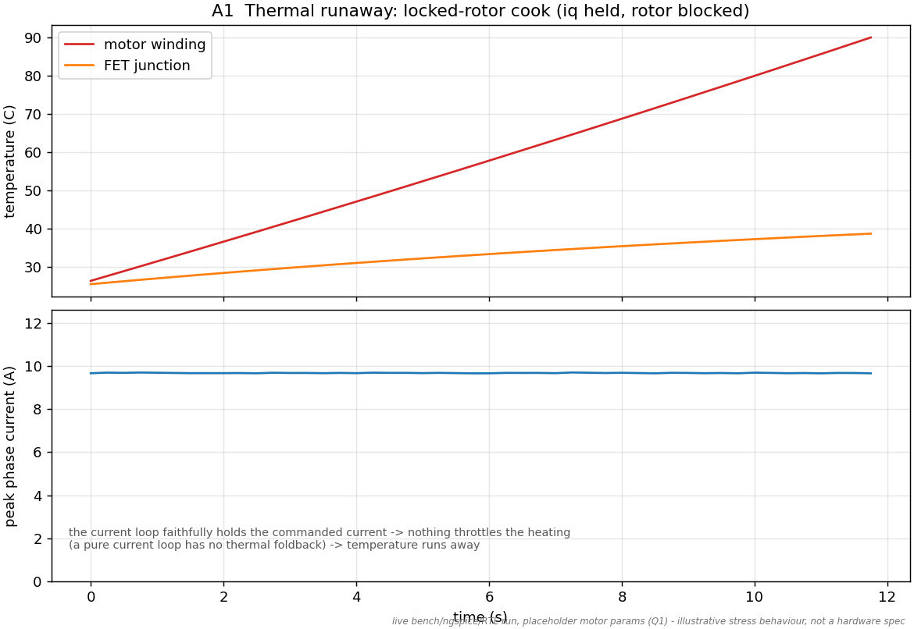
### A2 Brownout cascade (weak supply → UVLO)
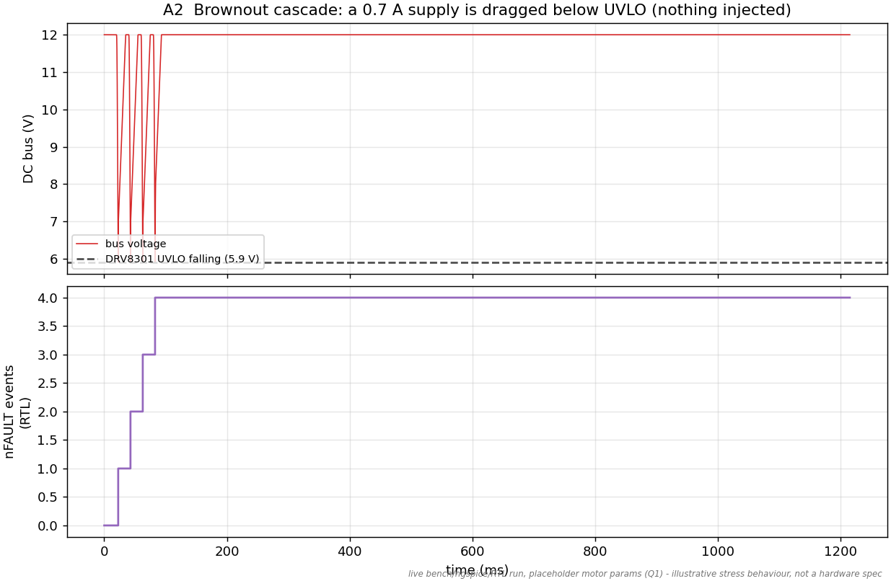
### A3 Regen overvoltage (hard decel pumps the bus, guard bounds it)
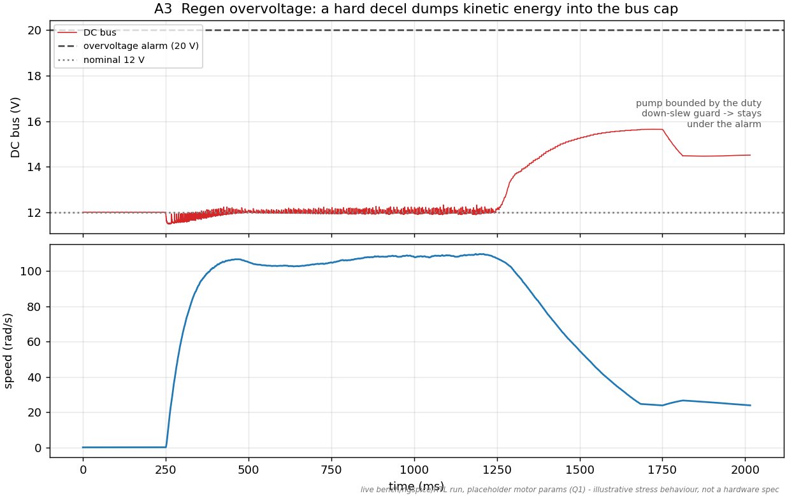
### A4 Overcurrent command (iq clamp + zero shoot-through)
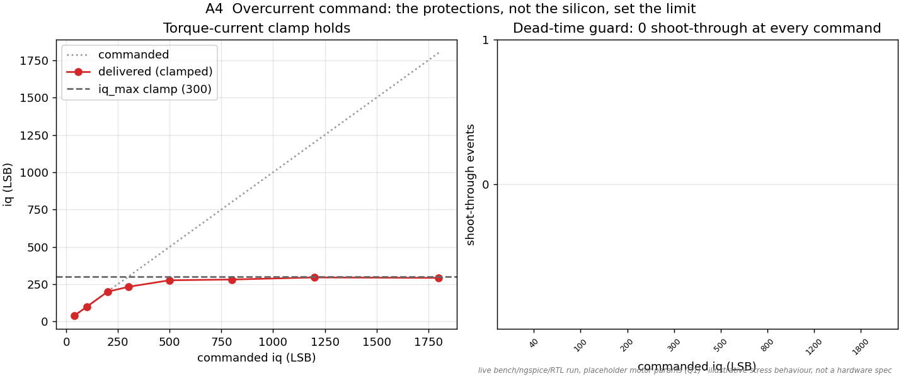
### A5 Fault injection (detected)
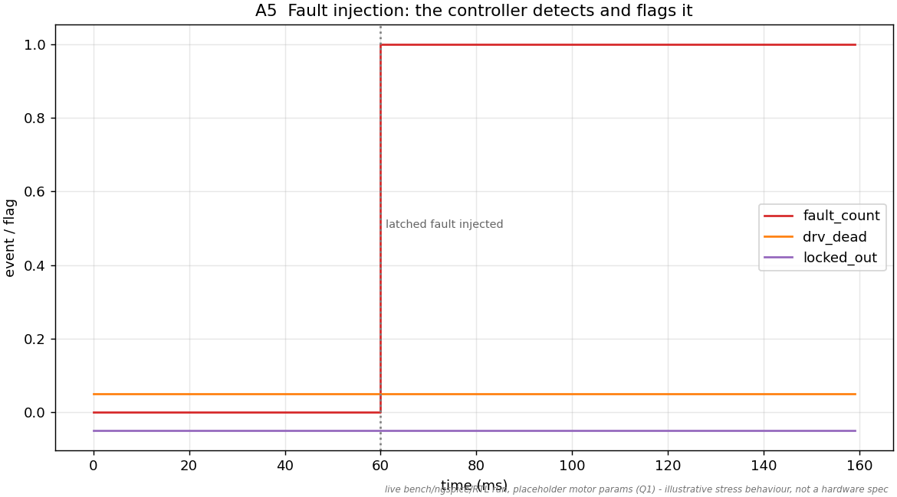

## B — Control & sensor limits
### B1 Reversal cliff to loss-of-lock (AS5600 vs AS5047P)
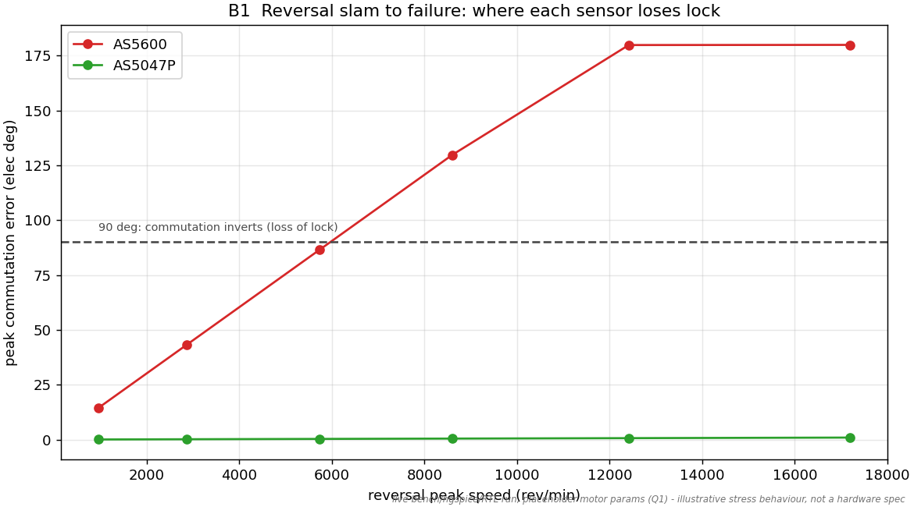
### B2 Extreme load step (survivable)
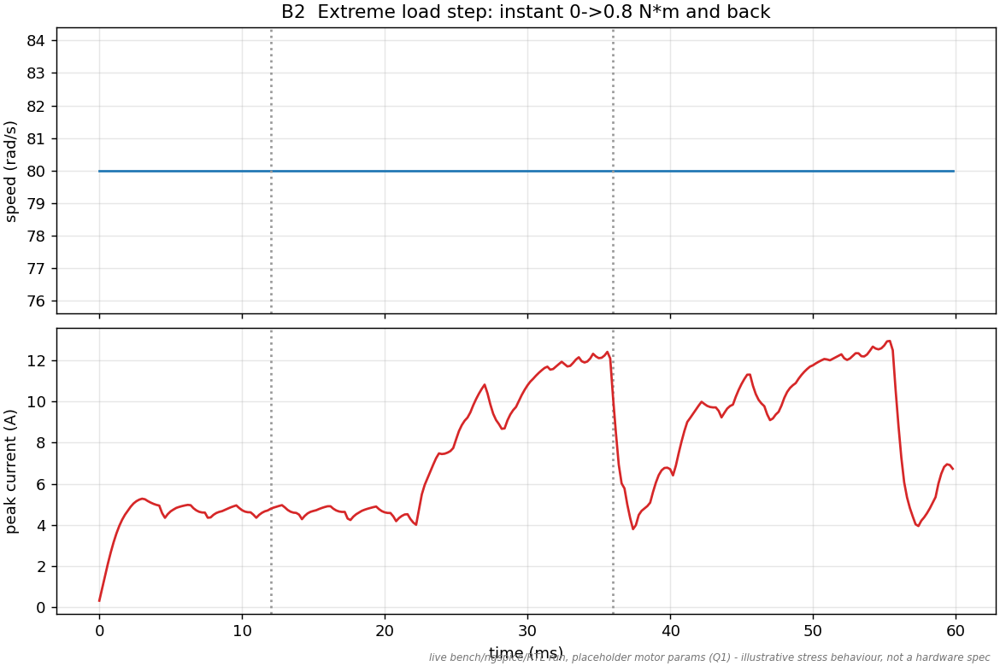

## C — Analog / ADC extremes
### C1 Settling failure boundary (oversized bucket misses tACQ)
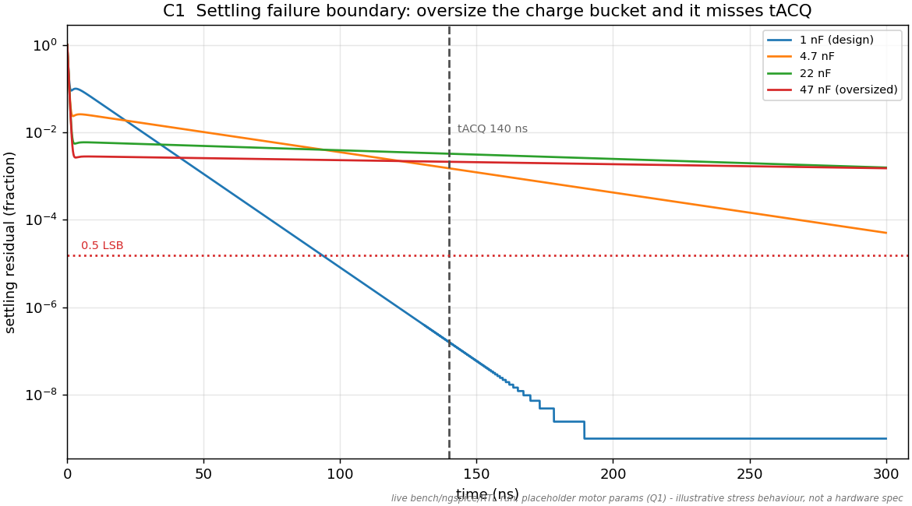
### C2 Full-scale code clipping (rails, no wrap)
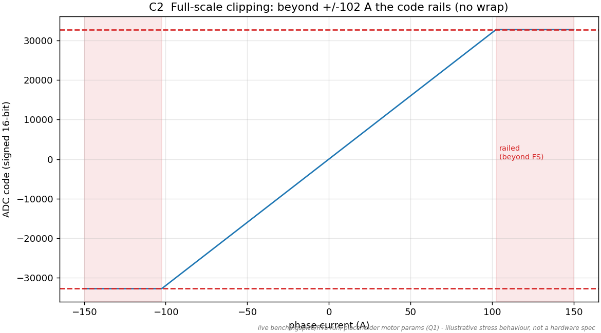

## D — Numerical / code edge cases
### D1 Fixed-point rails (duties clamp; dq wraps only past the rail)
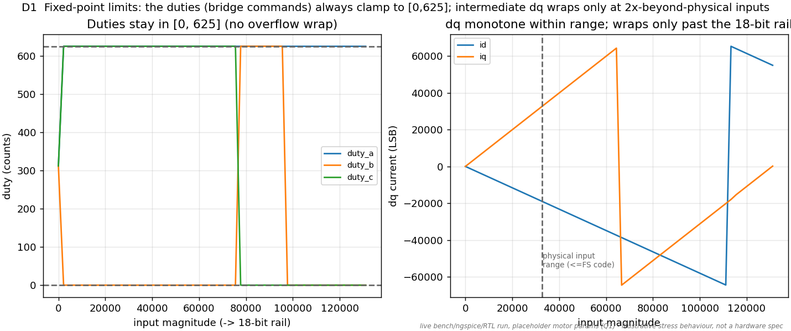
### D2 Circle-limiter saturation
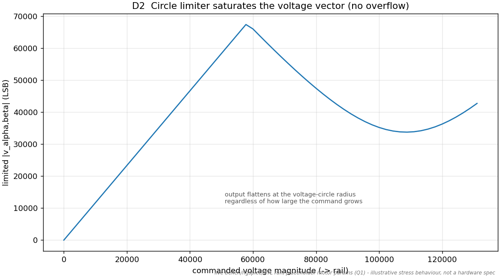
