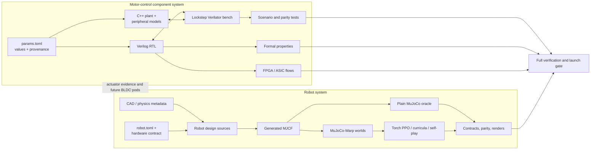

<!-- SPDX-License-Identifier: MIT -->
# System architecture

> **Document status:** Current · **Audience:** Newcomers and system contributors · **Last reviewed:** 2026-07-12 · **Canonical for:** Whole-repository boundaries, data flow, and subsystem relationships

Motorloop contains two executable systems joined by shared contracts and
verification practice. They run under one repository and one full launch gate,
but they are not one monolithic runtime simulator.

## 1. Motor-control component system

The component side answers whether controller RTL behaves correctly at modeled
chip and physical boundaries.

1. `sim/config/params.toml` records values, units, provenance, and unresolved
   questions.
2. Verilator compiles the controller RTL.
3. The C++ bench supplies the inverter, motor, supply, gate-driver, ADC, and
   sensor dynamics in the same process.
4. Python drives scenarios and asserts on physical state, decoded measurements,
   controller belief, and faults.
5. Independent Python and Modelica plant implementations provide model-form
   comparison.
6. Formal and synthesis flows check plant-independent properties and
   implementation feasibility.

The focused architecture decision record is [`architecture.md`](architecture.md).

## 2. Robot system

The robot side answers whether a generated body and a policy behave under
contact, commands, uncertainty, and adversarial tasks.

1. Robot design sources and CAD-derived metadata produce MJCF.
2. Plain MuJoCo is the semantic CPU oracle and rendering path.
3. MuJoCo-Warp runs many worlds in parallel on CPU or CUDA.
4. Torch owns PPO networks, optimization, checkpoints, and offline helpers.
5. Model-contract, parity, reward-red-team, deterministic-CPU, bounded-CUDA,
   and video gates protect behavioral claims.

The active physical design constraints are in
[`robot-hardware-contract.md`](robot-hardware-contract.md). The mandatory launch
procedure is [`pre-gpu-test-entrypoint.md`](pre-gpu-test-entrypoint.md).

## 3. The seam between them

The systems share three things today:

- **Engineering method:** explicit assumptions, executable contracts, generated
  evidence, and failure-before-hardware gates.
- **Potential actuator contracts:** motor envelopes and controller limitations
  can parameterize robot actuators or future distributed BLDC power pods.
- **One full verdict:** the CUDA-host launch gate includes the complete CPU
  component/Verilator regression before it authorizes long robot runs.

The current twelve-servo robot does **not** execute the Verilog FOC controller in
every Warp step. Saying “end to end” refers to repository coverage and traceable
contracts, not a cycle-accurate RTL-in-the-loop robot policy trainer.

## 4. Sources of truth

| Concern | Source |
| --- | --- |
| Component parameters and provenance | `sim/config/params.toml` |
| Reusable RTL interfaces | `rtl/contracts/` |
| Formal proof definitions | `formal/manifest.toml` |
| Active robot physical envelope | `notes/robot-hardware-contract.md` |
| Parametric robot source | `sim/robot/robot.toml` |
| Active mesh-derived implementation | `sim/robot/gen_mesh_robot_mjcf.py` and `sim/robot/robot_design.py` |
| Full robot/RL launch decision | `scripts/run_pre_gpu_tests.sh --require-gpu` |
| Project maturity | `notes/current-status.md` |

## 5. Repository map

| Path | Responsibility |
| --- | --- |
| `rtl/` | Controller and reusable motor-control RTL |
| `sim/cpp/` | Lockstep plant and peripheral bench |
| `sim/tests/` | Component, parity, and scenario regressions |
| `formal/` | Formal manifests, checkers, and reports |
| `synth/` | FPGA, portability, and ASIC-readiness flows |
| `sim/robot/` | Robot generation, physics, learning, evaluation, and tests |
| `hw/` | Hardware and circuit design artifacts |
| `notes/` | Curated guides plus clearly classified work records |
| `figures/` | Generated plots, galleries, and behavior media |

For a task-oriented route through these paths, use
[`reader-paths.md`](reader-paths.md).
